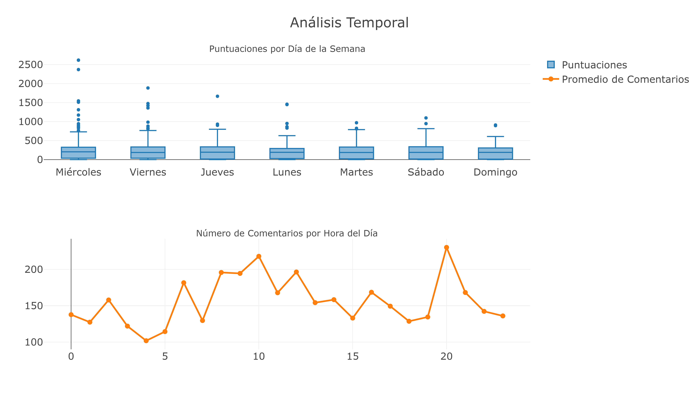
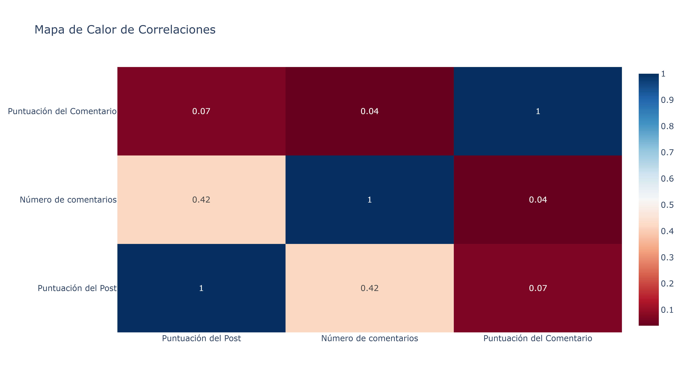
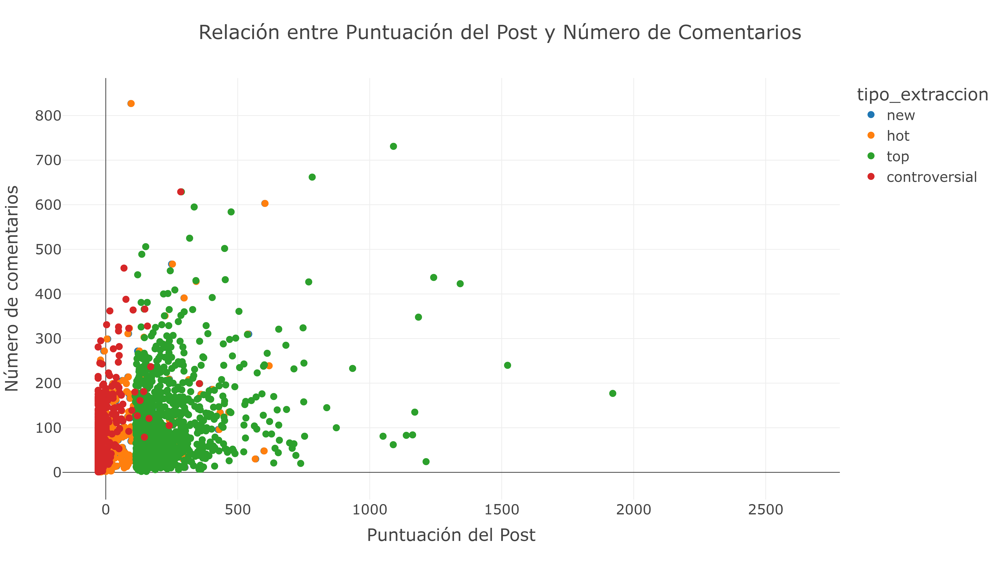
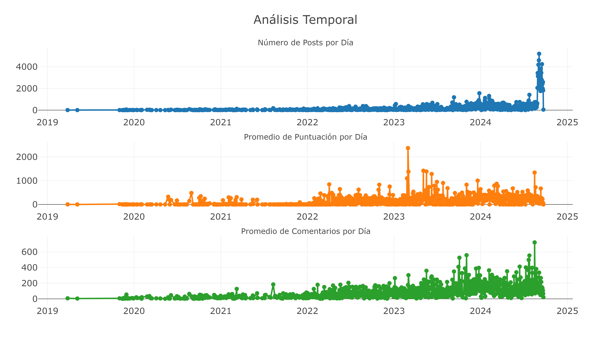
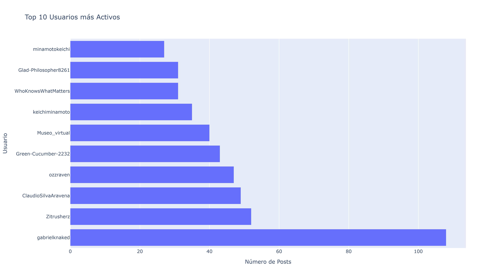

# Trabajo_2_analitica_descriptiva

Integrantes: 
* Diego Santibañez
* Oscar Martinez

Debido al tamaño del archivo principal con el que se trabajó, este no estará disponible en este repositorio pero se puede encontrar en el siguiente [link](https://drive.google.com/file/d/1iPzFuoqFbbNPh21eGHBgukvHiFGkQPBB/view?usp=sharing

## **Análisis de Distribuciones**

En estos subgráficos, se muestra diferentes variables relacionados con la actividad en el subreddit r/RepublicadeChile

* Distribución de Puntuaciones de Publicaciones (Posts): En el gráfico esquina superior izquierda muestran las evaluaciones que reciben las publicaciones en la comunidad. La mayoría de las publicaciones tienen calificaciones bajas, entre 0 y 50, con un fuerte sesgo hacia la izquierda, interpretando que la mayoría de las publicaciones no alcanza una gran cantidad de votos positivos. Sin embargo, hay una minoría de publicaciones que logran puntajes mucho más altos, superando los 1500 puntos, pero representan una proporción muy pequeña del total.  
  
* Distribución del Número de Comentarios: En el gráfico en la esquina superior derecha, se observa que la mayoría de las publicaciones tienen menos de 100 comentarios, con muy pocas superando los 800. La tendencia muestra que, al igual que con las evaluadas, la mayoría de las publicaciones no reciben una gran cantidad de comentarios. Las publicaciones con un número alto de comentarios representan casos atípicos o tópicos que generan mucho interés o debate dentro de la comunidad.
  
* Distribución de puntuaciones de comentario: El gráfico en la parte inferior izquierda ilustra que la mayoría de las evaluaciones se encuentran cercanas a 0, y hay muy pocos comentarios que logran evaluaciones superiores a 50. Esto indica que la mayoría de los comentarios reciben poca retroalimentación en términos de votos positivos o negativos. La falta de puntuación elevada sugiere que los usuarios no suelen interactuar con los comentarios tanto como lo hacen con las publicaciones, lo que podría reflejar un menor nivel de engagement a nivel de discusión detallada.
  
* Distribución de Puntuaciones por Tipo de Publicación: El gráfico en la parte inferior derecha muestra un boxplot de las evaluaciones por tipo de publicación: new , hot , top , y controversial . Se observa que:
  
  * Las publicaciones en la categoría top tienen la mayor variabilidad y puntajes más altos, con valores atípicos que superan los 2000 puntos.
    
  * Las categorías nuevo y caliente tienen evaluaciones más bajas en promedio, pero aún presentan una dispersión considerable.
    
  * La categoría controversial tiene calificaciones más bajas y menos variabilidad, indicando que estas publicaciones generan menos interés a pesar de la polarización que pueden crear.
    

Esto sugiere que las publicaciones en la categoría “top” logran captar la mayor                   atención, mientras que las publicaciones controversiales no siempre generan tanto engagement como cabría esperar. Esto podría deberse a que las publicaciones top tienden a ser más relevantes para la comunidad, mientras que las controversiales podrían ser ignoradas o divisivas.

## Análisis temporal

* En el gráfico superior se muestra la puntuación por días de la semana en donde cada caja representa la distribución de las evaluaciones de las publicaciones según el día de la semana. Observamos que los puntajes de las publicaciones tienden a ser similares durante la semana, con puntajes más altos algunos días como miércoles y viernes , donde hay más variabilidad y publicaciones con puntajes muy altos.
  
* En el gráficos inferior se muestra el número de comentarios por hora del día, en donde se muestra como varía el número de comentarios a lo largo del día, en donde se muestra que la actividad más alta, ocurre en la noche (20 horas), sugiriendo que la comunidad es más activa a esa hora.
  

## Mapa de correlación

La puntuación del post y Número de comentarios hay una correlación positiva moderada, mostrando que los post con mayor puntuación tienden a tener más comentarios aunque su relación no es fuerte. La relación de las correlaciones mostradas, muestran que entre la puntuación del Post y Puntuación del comentario es débil, casi  inexistente, en el que no están correlacionados

## Relación entre Puntuación del Post y Número de Comentarios

En este gráfico, se muestra las distribuciones generales de las categorías trabajadas, con las variables de  número de comentarios por la puntuación del post , en donde las categorías más destacadas, son el “top”,que muestra el mayor dominio del gráfico, seguido de la categoría “controversial” en el que se concentra en la parte inferior izquierda, con puntuaciones bajas pero un número variable de comentarios.

## Análisis historico de posts, puntuación y comentarios

Para estos subgráficos, se muestra un análisis temporal desde el primer post encontrado desde marzo del 2019 hasta septiembre del 2024 en donde cada gráfico muestran distintos datos:

Número de Posts por Día (azul):

* Muestra un crecimiento gradual desde 2019.
  
* Hay un pico significativo a finales de 2024, llegando a más de 4000 posts en un día.
  

Promedio de Puntuación por Día (naranja):

* Fluctúa considerablemente a lo largo del tiempo.
  
* Algunos picos notables en 2023 y 2024, con días alcanzando puntuaciones promedio superiores a 2000.
  

Promedio de Comentarios por Día (verde):

* Muestra un aumento gradual a lo largo del tiempo.
  
* Hacia finales de 2024, se observan días con un promedio de más de 600 comentarios.
  

## Top usuarios con más Posts

En este gráfico, se muestra los usuarios que son los más activos en el subreddit r/RepublicadeChile por el número de posts realizados.

# Conclusiones

El análisis del subreddit r/RepublicadeChile permite obtener una comprensión del comportamiento y las interacciones de sus usuarios en el foro. A partir de la extracción de aproximadamente 3000 publicaciones y 182,485 comentarios, se realizó un análisis cuantitativo detallando la frecuencia de participación por horas y días más activos, además de evaluar la correlaciones claves entre la puntuación y el número de comentarios

Con la metodología aplicada, se logró obtener una limpieza y transformar los datos para asegurar la calidad de los mismos y trabajar con las categorías de las publicaciones en función de su relevancia. Entre los resultados obtenidos, se destaca la participación de la comunidad con promedios de 78,64 comentarios por publicación y 233,11 puntos de valoración por publicación, también logramos identificar cuáles de las categorías seleccionadas, se tienden a tener más relevancia por el tipo de contenido que se pueda encontrar, por lo tanto, para futuras investigaciones, se utilizaran modelos pre-entrenados para análisis de sentimientos y poder tener un análisis más detallado sobre el tipo de comentarios que se hacen por publicación.
